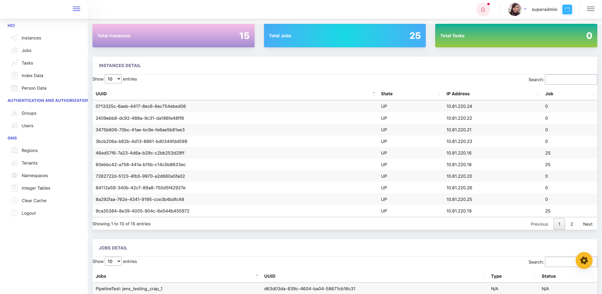
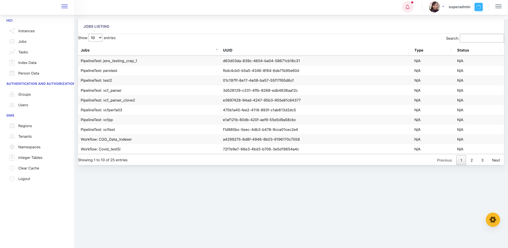
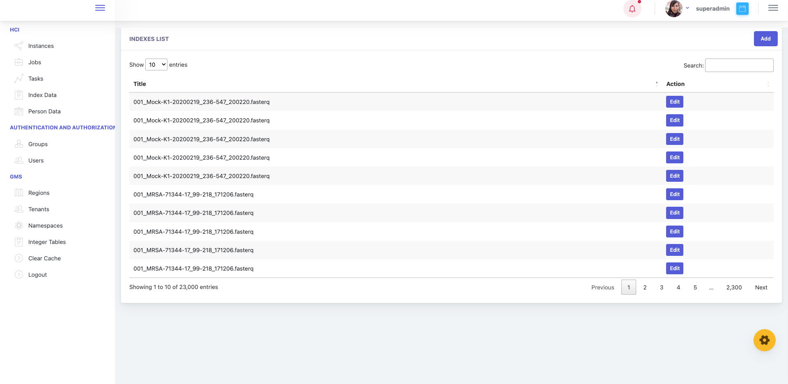
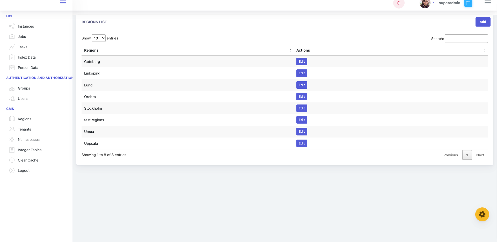
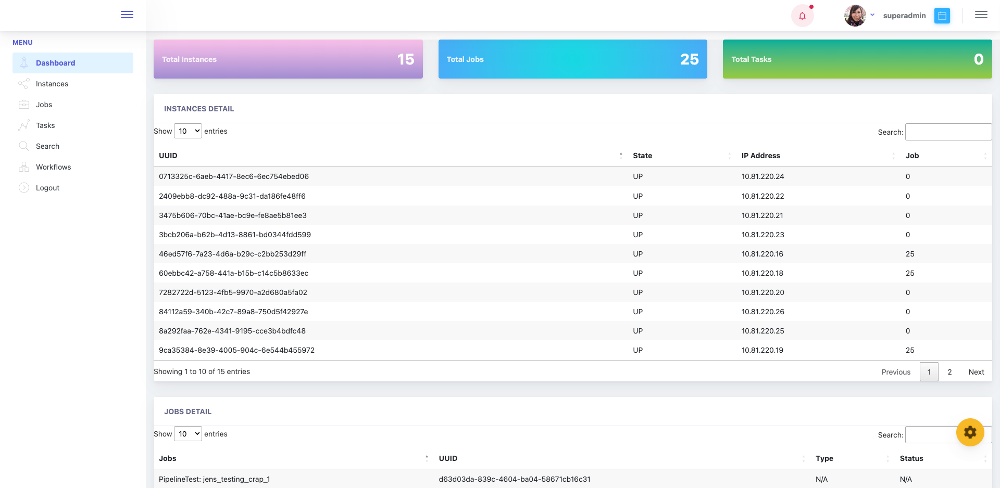
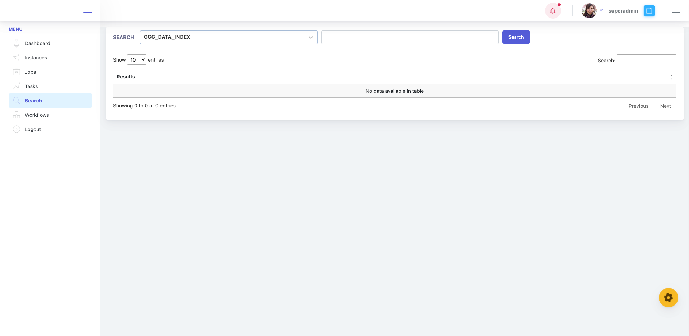
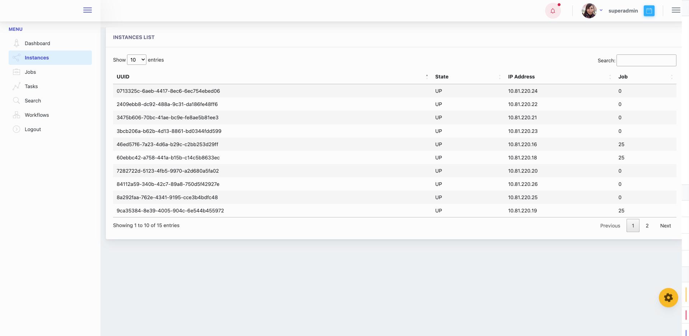
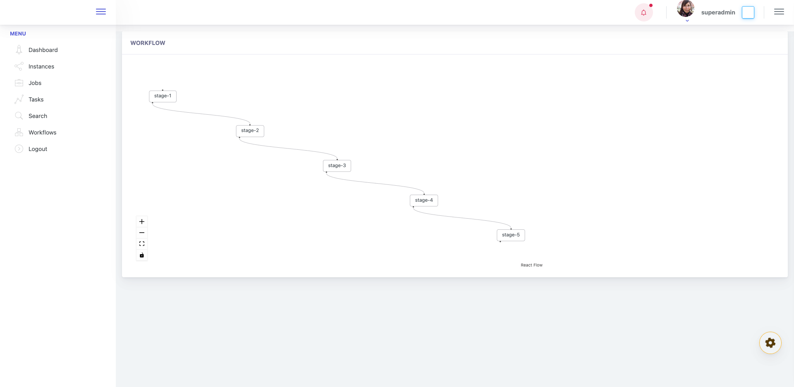
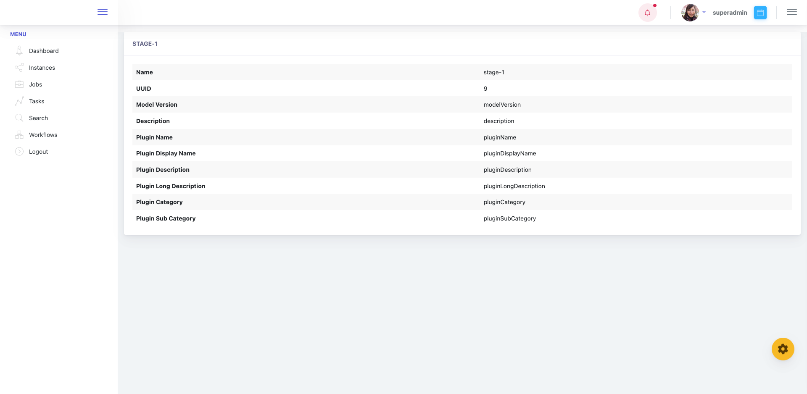

## Project Title

NGP Portal

## Table of Content:
* Description
* NGP Portal admin
* NGP Portal users
* Setup & Run

#### Description
NGP portal is used here as a collective name for several components that together make up a web-based portal for accessing analysis software and services in NGP.
#### NGP Portal admin
The admin panel is included with NGP Portal build and can be found under NGP Portal. it exist in order to give admin and Group admin control over NGP as:
* Add/Remove Regions, 
* Status of Instances, Jobs, Tasks
* Add/Remove permissions to users.
* Define which users has access to Workflow.
* Define which users has access to Pipeline.
* Define which users has access to Indexes.
* Define which users has access to Indexes collections.
* Define which users has access to Search Indexes objects under Group.
* etc ...

                           *Admin Dashboard*

-----

                           *Admin Jobs*

-----

                           *Admin Indexes*

-----

                           *Admin Regions*

-----

#### NGP Portal (front) users
The User Detail Panels gives quick access to all information we have for a given user as :
*  Status of Instances, Jobs, Tasks.
*  Search of Indexes.
*  The current list of Workflow.
*  The current list of Pipeline.
*  The current list of stages.
*  An overview of all tracked jobs events.
*  etc ...

                           *client-side Dashboard*

-----

                              *Search-indexes*

-----

                               *instances list*

-----

                               *Workflow Stages*

-----

                              *Stages*

-----

#### Setup & Run App

In the project directory, you can run:

##### `npm start`

The page will reload when you make changes.\
You may also see any lint errors in the console.

##### `npm test`

Builds the NGP portal for production to the `build` folder.\
It correctly bundles React in production mode and optimizes the build for the best performance.

##### `npm run build`

